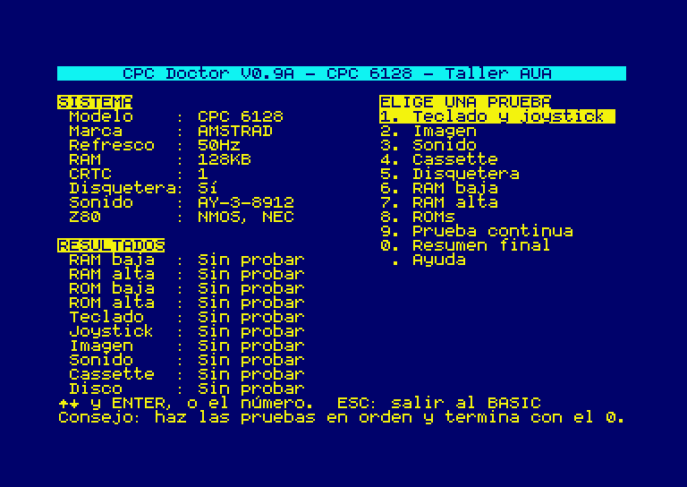
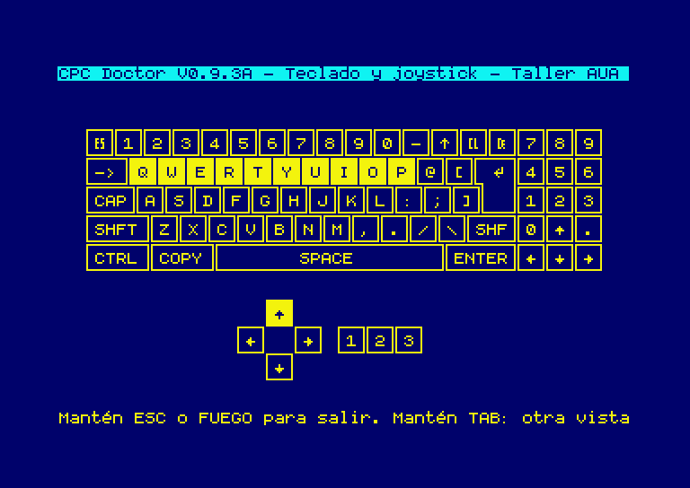
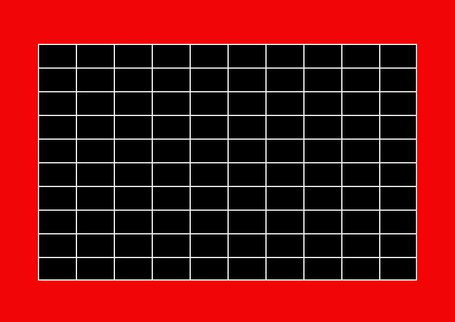
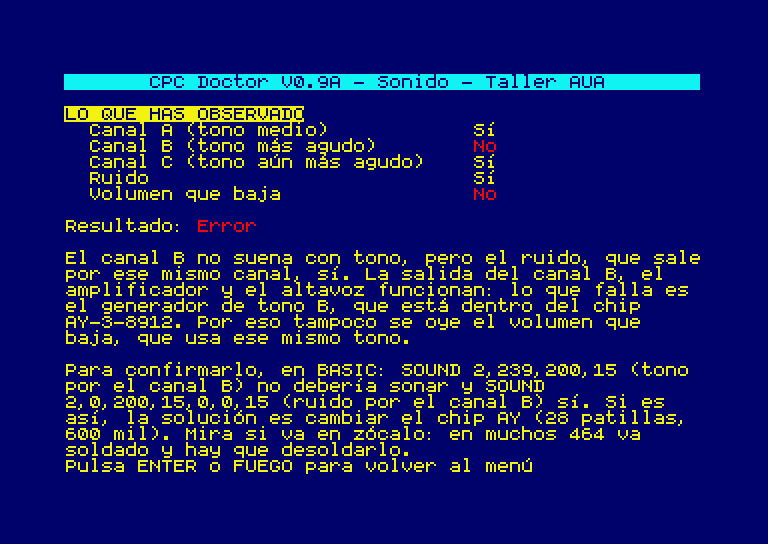
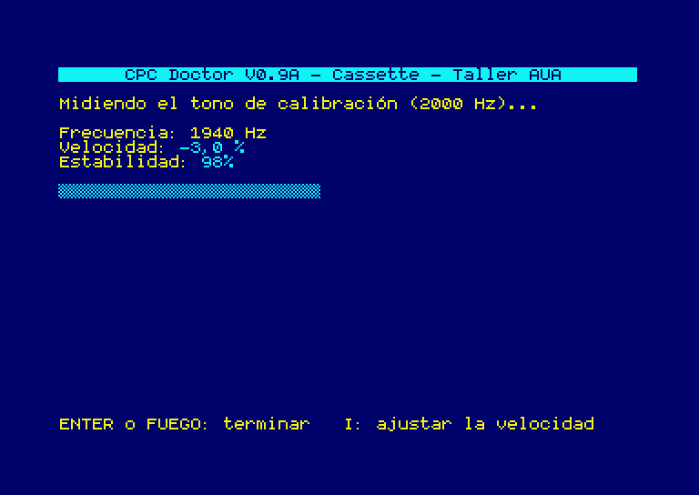
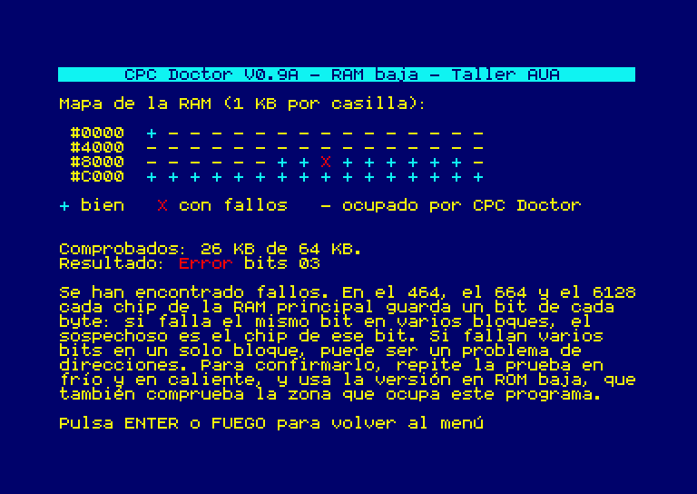
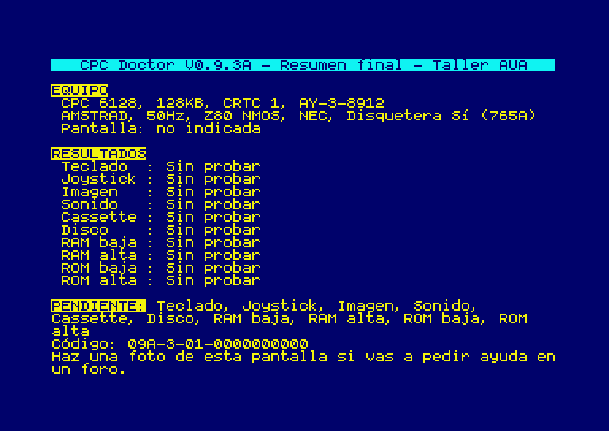
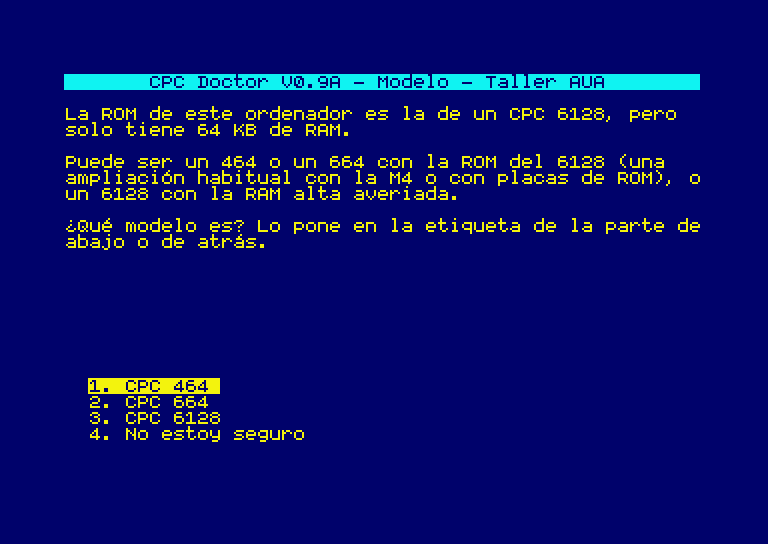
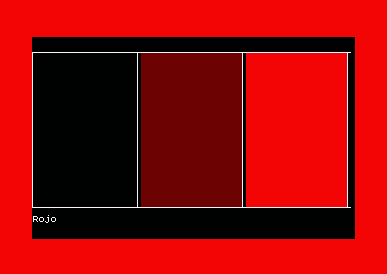
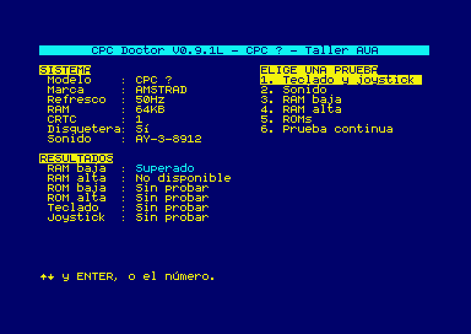

# CPC Doctor

Diagnóstico guiado para ordenadores **Amstrad CPC** que se ejecuta en el propio
ordenador. Para quien recupera su CPC, compra uno de segunda mano o necesita
explicar una avería en un foro.

Hecho para el taller de la Asociación de Usuarios de Amstrad (AUA). Está
basado en [Amstrad Diagnostics](https://github.com/llopis/amstrad-diagnostics)
de Noel Llopis (ver [En qué se basa](#en-qué-se-basa)).



*[English summary below](#english)* · *Lee la [exención de responsabilidad](#exención-de-responsabilidad) antes de usarlo.*

## Qué hace

Cada prueba explica **qué se comprueba**, **qué tienes que hacer o mirar**,
**qué se ha obtenido** y **qué comprobar después**. Separa lo observado de la
posible causa, y la causa se presenta como algo que hay que confirmar, no como
un diagnóstico seguro.

| Resultado | Significado |
|---|---|
| **Superado** | La prueba ha salido bien. |
| **Error** | Se ha observado un fallo. |
| **Inconcluso** | No se puede asegurar: faltan datos o la respuesta fue "no estoy seguro". |
| **Sin probar** | Todavía no se ha hecho. |
| **No disponible** | El equipo no tiene esa parte (por ejemplo, RAM alta en un 464). |

| Prueba | Cómo se obtiene el resultado |
|---|---|
| **Identificación** | Modelo (según la ROM; si hay dudas, lo pregunta), marca, 50/60 Hz, RAM, tipo de CRTC (0 a 5), chip de sonido (AY o YM), disquetera y tipo de Z80. |
| **1. Teclado y joystick** | Medido. Teclas sin respuesta, **atascadas** desde el principio y con **rebotes** (contacto intermitente). Si falla una línea o columna entera de la matriz, o si hay teclas que se encienden juntas, lo señala. Explica las teclas fantasma para que no se tomen por averías. Al arrancar mide además si el puerto del chip AY que lee el teclado es lento, algo que pasa con algunos AY de recambio. |
| **2. Imagen** | Respuestas del usuario a patrones: niveles de cada color, escala de brillo para el monitor verde, rejilla de geometría, líneas finas en Mode 2 e imagen en movimiento. Los consejos dependen de la pantalla usada (CTM, GT65, modulador, RGB o conversor HDMI). |
| **3. Sonido** | Respuestas del usuario. Canales A, B y C por separado, ruido y envolvente de volumen. Cruzando las respuestas distingue, por ejemplo, un generador de tono averiado de una salida de audio averiada. |
| **4. Cassette** | Medido. Velocidad del motor y estabilidad de la señal con un [tono de calibración](audio/). Se repite cada segundo para ajustar el azimut o la velocidad, con instrucciones (tecla I). |
| **5. Disquetera** | Medido. Velocidad de giro en rpm. |
| **6. RAM baja** | Medido. En la versión de cinta y disco comprueba la memoria que no ocupa el programa y muestra un **mapa**. La ROM baja comprueba de #4000 a #FFFF y la ROM alta de #0000 a #BFFF. |
| **7. RAM alta** | Medido. Bancos de 64 KB hasta 4 MB y configuración C3. |
| **8. ROMs** | Medido. Identifica la ROM baja y las altas por su CRC. |
| **9. Prueba continua** | Medido. Repite las pruebas de memoria y ROM sin parar, para fallos que aparecen en caliente. |
| **0. Resumen final** | Una pantalla para fotografiar: equipo, resultados, lo pendiente y un código con todos los resultados. |

Las pruebas de **imagen y sonido** dependen de lo que ves y oyes: el programa no
las puede medir y no las presenta como mediciones. **ESC** en el menú vuelve al
BASIC.

**Modo automático.** Si al arrancar no se pulsa nada en 30 segundos (por
ejemplo, porque el teclado no funciona), CPC Doctor sigue solo: prueba teclado y joystick,
muestra los patrones de imagen y toca los sonidos sin preguntar (quedan sin
probar, porque el programa no sabe qué has visto y oído), y mide disquetera,
RAM baja, RAM alta y ROMs. Termina en el resumen. El modelo se toma de la ROM sin confirmar. La prueba de
teclado y joystick termina sola tras 10 segundos sin pulsaciones, también fuera
de este modo.

<p>



</p>
<p>



</p>
<p>



</p>

*Capturas del emulador de pruebas del proyecto (`tools/capturas.sh`).*

## Versiones y carga

`./build.sh` genera en `build/dist/`, en español (`es`) e inglés (`en`):

| Fichero | Uso |
|---|---|
| `cpcdoctor-es.dsk` | Disco. `RUN"DOCTOR`. |
| `cpcdoctor-es.cdt` / `.wav` | Cinta. `RUN"` y PLAY. El WAV se puede reproducir desde un móvil u ordenador. Lleva detrás el tono de la prueba de cassette. Carga en unos 4 minutos. |
| `cpcdoctor-es-lower.rom` | **ROM baja**: sustituye a la ROM del sistema (en una EPROM o una placa que la reemplace). Sirve para los CPC que **no arrancan**, porque funciona aunque la RAM falle. |
| `cpcdoctor-es-upper.rom` | ROM alta, para una placa de ROMs o la M4. `|DOCTOR` (o `|DIAG`). |
| `cpcdoctor-es.cpr` | Cartucho para CPC Plus y GX4000. |
| `cpcdoctor-tono-2000hz.cdt` / `.wav` | Tono de calibración (también en [`audio/`](audio/)). |

Las versiones ROM no llevan las pruebas guiadas porque no caben en 16 KB: tienen
las pruebas técnicas con la interfaz nueva.

## En qué se basa

CPC Doctor parte de **[Amstrad Diagnostics](https://github.com/llopis/amstrad-diagnostics)
de Noel Llopis** (licencia MIT), del que conserva las pruebas técnicas de RAM,
ROM, teclado y CRTC. En ese proyecto participaron Brendan Alford, Gérald
Vincent, Kevin Thacker, Rhino, KaosOverride, Spirax, issalig y Cacharreo.

También incorpora trabajo publicado por otras personas en forks y propuestas a
Amstrad Diagnostics:

| De | Qué |
|---|---|
| kuro68k | Test de memoria MARCH C- ([PR #14](https://github.com/llopis/amstrad-diagnostics/pull/14)) |
| Renaud Guérin | Cartucho CPR correcto con `SAVECPR` ([PR #18](https://github.com/llopis/amstrad-diagnostics/pull/18)) |
| Cheshirecat y Lordheavy | Idea para detectar el CRTC 5 |
| nicolas-robin | CRC del BASIC del 464 francés |
| **Ismael Salvador** | Velocidad de la disquetera y tipo de Z80, de su fork [issalig/amstrad-diagnostics](https://github.com/issalig/amstrad-diagnostics). **Gracias, Ismael.** La medida de la disquetera parte a su vez del programa RPM de Brice Rive, Philippe Depré y Simon Owen. |

Otras piezas de terceros:
- Emulador de pruebas: [chips](https://github.com/floooh/chips), de Andre Weissflog (licencia zlib).
- Detección del tipo de Z80: métodos de [Sergey Kiselev](https://www.malinov.com/sergeys-blog/z80-type-detection.html) y [redcode/Z80_XCF_Flavor](https://github.com/redcode/Z80_XCF_Flavor).

## Estado

Versión **0.9**. Se han probado en un **CPC 464 real** (con M4 Board y la ROM
del 6128): la carga, la identificación, la pregunta del modelo, el teclado y el
joystick, el sonido (que encontró una avería real en el chip AY), la RAM baja,
la prueba continua, la ayuda y la salida al BASIC.

Todo lo demás está comprobado solo en el emulador de pruebas (76 comprobaciones
automáticas). Falta probar en máquinas reales, entre otras cosas, la
disquetera, la cassette con el tono, otros modelos, CRTC y ampliaciones. Ver
[docs/VALIDACION.md](docs/VALIDACION.md). Si lo pruebas en tu CPC, cuéntalo.

## Compilar y probar

Ver [docs/COMPILAR.md](docs/COMPILAR.md). En resumen: sjasmplus 1.21 o
posterior y Python 3.

```bash
./build.sh          # compila todas las versiones
tests/run.sh        # pruebas automáticas en el emulador
tools/m4.sh         # lo sube a una M4 Board y lo ejecuta en el CPC
```

Los textos están en `lang/es.txt` y `lang/en.txt`. Para otro idioma basta con
copiar uno, traducirlo y añadir su código a `build.sh`.

## Exención de responsabilidad

CPC Doctor se ofrece **tal cual, sin garantía de ningún tipo**, como indica su
licencia MIT. Sus autores y colaboradores, y los de los proyectos en los que se
basa, **no se hacen responsables** de ningún daño, avería, pérdida de datos o
lesión que pueda derivarse de su uso o de seguir sus indicaciones.

- Las causas que propone son **orientativas**, no un diagnóstico profesional.
  Confírmalas antes de cambiar piezas.
- Abrir el ordenador o el monitor, soldar, desoldar o ajustar componentes lo
  haces **bajo tu responsabilidad**. El interior de los monitores (CTM, GT64,
  GT65) y de las fuentes de alimentación tiene **tensiones peligrosas**, incluso
  apagados. Si no tienes experiencia, pide ayuda.
- Las pruebas escriben en la memoria y en los puertos del ordenador, pero no en
  discos ni cintas. Aun así, retira los discos y las cintas con datos que te
  importen antes de usarlo.
- Amstrad, CPC y las demás marcas pertenecen a sus propietarios. Este proyecto
  no está vinculado a Amstrad ni a los autores de Amstrad Diagnostics.

## Licencia

MIT (ver [`LICENSE`](LICENSE)), como Amstrad Diagnostics. El emulador de
pruebas usa código de [chips](https://github.com/floooh/chips) bajo licencia
zlib (`tools/emu/chips/LICENSE`).

---

## English

**CPC Doctor** is a guided diagnostic tool for Amstrad CPC computers that runs
on the machine itself. It is based on Noel Llopis' [Amstrad
Diagnostics](https://github.com/llopis/amstrad-diagnostics). The disc drive speed test and the Z80 type detection come
from Ismael Salvador's fork,
[issalig/amstrad-diagnostics](https://github.com/issalig/amstrad-diagnostics) —
thank you, Ismael.

Every test explains what is being checked, what you need to do, what was found
and what to check next. Possible causes are always presented as things to
confirm, not as a certain diagnosis. Picture and sound tests rely on what the
user sees and hears and are reported as such. Keyboard, cassette, disc drive,
memory and ROM tests are measurements. If nothing is pressed for 30 seconds
after loading (for example, because the keyboard is dead), the tests that need
no answers run by themselves and end on the summary.

Build with `./build.sh` (sjasmplus ≥ 1.21, Python 3) and run the automated tests
with `tests/run.sh`. Version 0.9 has been partly tested on a real CPC 464; see
[docs/VALIDACION.md](docs/VALIDACION.md).

**Disclaimer:** CPC Doctor is provided as is, without warranty of any kind (MIT
licence). Its authors and contributors, and those of the projects it is based
on, accept no liability for any damage, fault, data loss or injury arising from
its use or from following its advice. Suggested causes are only guidance.
Opening, soldering or adjusting the computer or the monitor is at your own risk:
monitors and power supplies contain dangerous voltages even when switched off.
This project is not affiliated with Amstrad or with the authors of Amstrad
Diagnostics.
